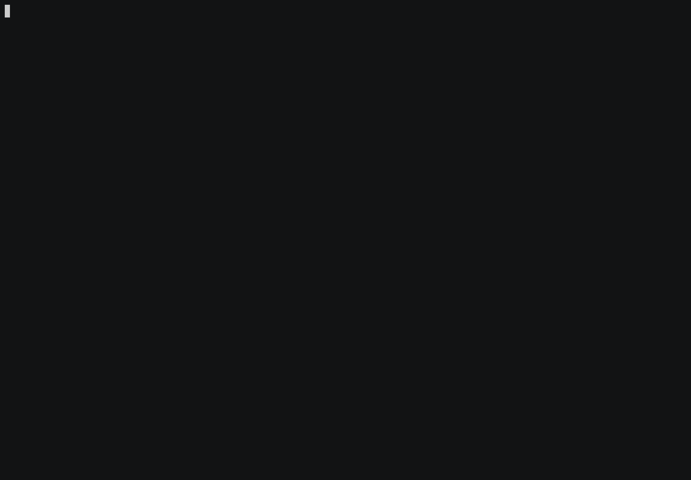

# pathos - CLI for editing a PATH env variable

## Background

If you're like me, you might have a number of `export PATH` statements
littering your shell resource file (e.g., `.zshrc`, `.bashrc`, etc). Over time,
many directory entries get added and revised. Those that remain eventually
become unnecessary, are mistakenly duplicated, or represent directories that no
longer exist on the system. This is my attempt at cleaning up `PATH`
environment variable. Hopefully, others will find this to be useful.

## Demo

### Built with the following:

  * [Go](https://go.dev/)
  * [Bubble Tea](https://github.com/charmbracelet/bubbletea)
  * [Bubbles](https://github.com/charmbracelet/bubbles)
  * [Lip Gloss](https://github.com/charmbracelet/lipgloss)

## Installation
    go install github.com/chip/pathos@latest

## IMPORTANT

Be sure to save your changes with `S` *(uppercase letter S)* before quitting
`pathos`, as **changes will not be saved automatically**.

Each time you save your changes to the directory list, `pathos` will build a
revised `export $PATH` statement that is written to `$HOME/pathos.sh`.

To use the new PATH, `~/pathos.sh` **MUST BE SOURCED** to take effect within your
shell.

    source $HOME/pathos.sh

## Navigation

Like any typical [Bubble Tea](https://github.com/charmbracelet/bubbletea) app,
you have the following keys that are available for navigation:

Key | Description
---|---
k | Move up the list of directories
j | Move down the list of directories
l | Move to the next page
h | Move to the previous page
g/home | Move to the top of the list
G/end | Move to the end of the list
q | Quit pathos **(does NOT save changes)**
? | Toggle between regular and full help

## Commands

Key | Description
---|---
N | Add a new directory to the list at the current cursor position
D | Delete a directory at the current cursor position
S | Save all changes made to the list of directories

## Color Highlighting

Color | Description
---|---
 &nbsp; Yellow &nbsp;  | Shows current cursor position
 &nbsp; Red &nbsp;  | Indicates directories that **do not exist**
 &nbsp; Aqua &nbsp;  | Indicates duplicate directories
